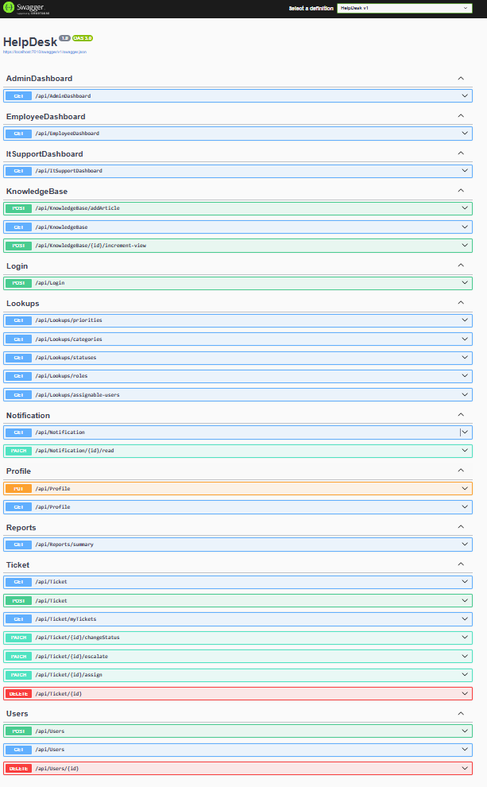
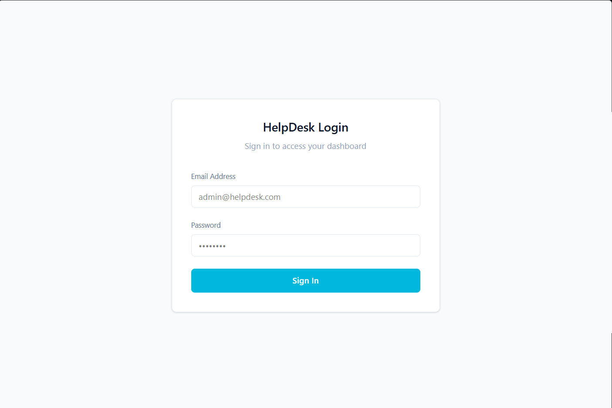
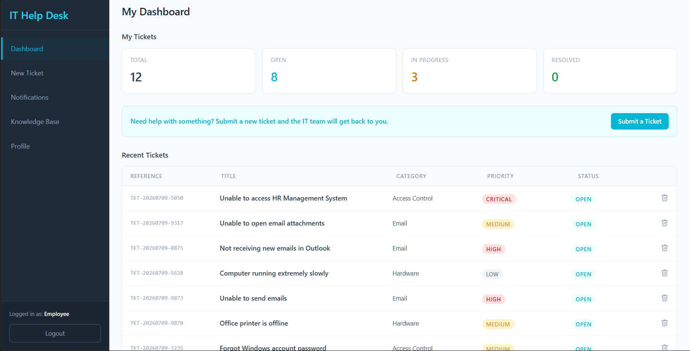
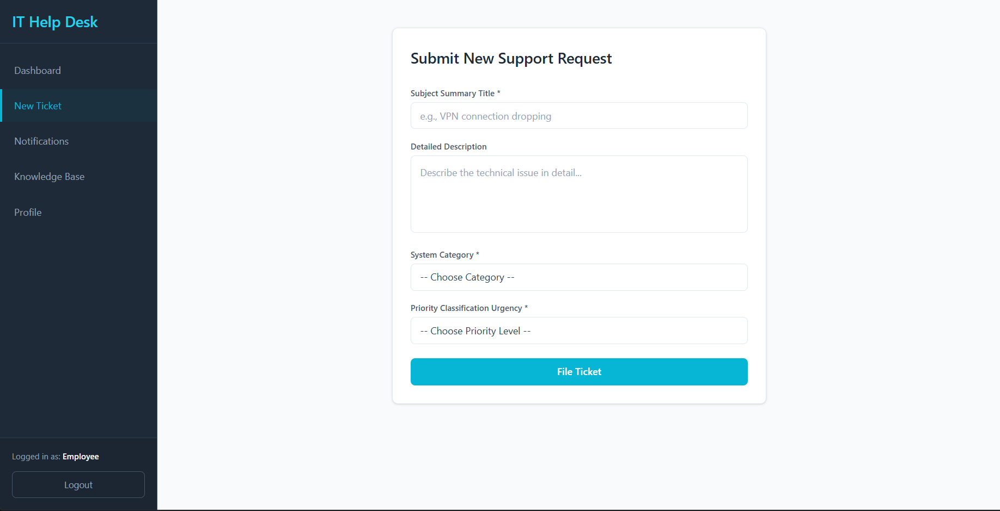
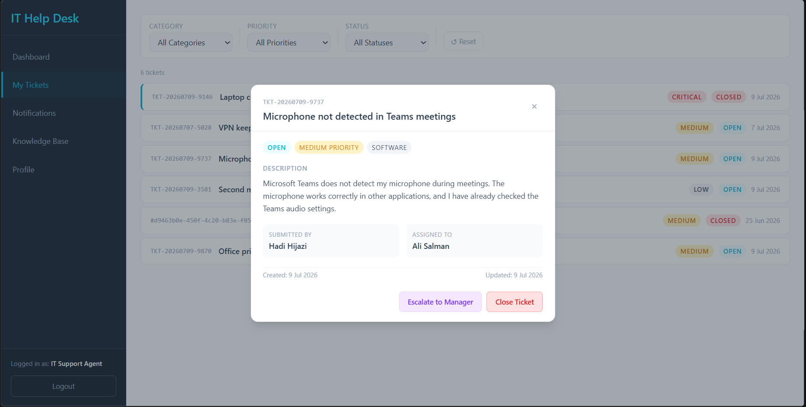
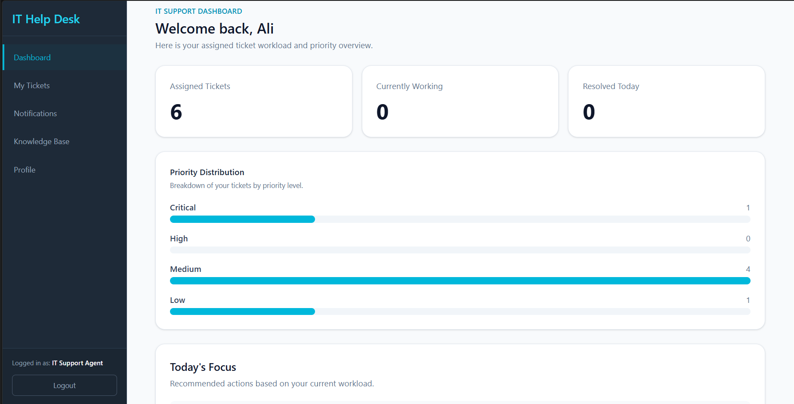
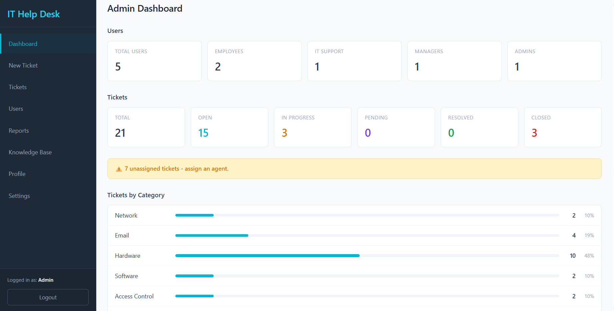

# IT Help Desk & Ticketing Management System

A full-stack, enterprise-style **IT Help Desk & Ticketing Management System** designed to streamline internal technical support operations.

The platform provides a role-based environment where employees can submit and track support requests, IT support agents can manage and resolve tickets, managers can monitor workloads and performance, and administrators can manage users, roles, and system operations.

This project was developed **individually as part of an internship**, with full responsibility for the frontend, backend, database, authentication, authorization, business logic, and application workflows.

---

## Overview

The IT Help Desk & Ticketing Management System models a real-world internal IT support environment.

The system manages the complete ticket lifecycle, from **ticket creation and assignment to escalation, resolution, and closure**, while providing dedicated functionality for employees, IT support agents, managers, and administrators.

### Main Capabilities

- Role-based ticket management
- JWT authentication and authorization
- Ticket creation, assignment, tracking, and resolution
- Ticket escalation
- Comments and file attachments
- Notifications
- Activity logging and auditing
- User and role management
- Manager dashboards and reporting
- Knowledge base
- RESTful API
- Swagger/OpenAPI documentation

---

## Key Features

### Authentication & Security

- User login and logout
- Password hashing
- JWT-based authentication
- Access and refresh tokens
- Token expiration and validation
- Role-based authorization
- Protected frontend routes
- Protected backend endpoints
- Password reset functionality

### Ticket Management

- Create support tickets
- Track ticket progress
- Assign tickets to IT support agents
- Update ticket statuses
- Manage ticket priorities
- Categorize tickets
- Escalate tickets
- Resolve and close tickets
- Add comments
- Upload ticket attachments
- Track ticket activity

### Dashboards & Management

The application provides dedicated dashboards based on the authenticated user's role.

- Employee dashboard
- IT Support dashboard
- Manager dashboard
- Admin dashboard
- Ticket assignment
- Team supervision
- Workload monitoring
- Reporting and summary data
- System monitoring

### Administration

Administrators can manage the overall system through:

- User management
- Role management
- System settings
- Ticket categories
- Ticket priorities
- Ticket statuses
- Activity logs
- System monitoring

### Additional Features

- Knowledge base
- Notifications
- User profiles
- Ticket categories
- Ticket priorities
- Ticket statuses
- Activity logs
- Ticket attachments
- Ticket comments

---

## Technology Stack

### Frontend

| Technology       | Purpose                           |
| ---------------- | --------------------------------- |
| **React.js**     | Frontend application              |
| **Vite**         | Development server and build tool |
| **Tailwind CSS** | UI styling                        |
| **JavaScript**   | Frontend logic                    |
| **HTML5**        | Application structure             |
| **CSS3**         | Styling and presentation          |

### Backend

| Technology                  | Purpose                                       |
| --------------------------- | --------------------------------------------- |
| **C#**                      | Backend programming language                  |
| **ASP.NET Core 8 Web API**  | RESTful backend API                           |
| **Entity Framework Core 8** | ORM and database access                       |
| **Dependency Injection**    | Service dependency management                 |
| **Service Layer**           | Business logic                                |
| **Repository Layer**        | Data access abstraction                       |
| **DTOs**                    | Data transfer and API contracts               |
| **Middleware**              | Request processing and cross-cutting concerns |
| **Swagger / OpenAPI**       | API documentation and testing                 |

### Database

| Technology                      | Purpose                    |
| ------------------------------- | -------------------------- |
| **PostgreSQL**                  | Relational database        |
| **EF Core PostgreSQL Provider** | PostgreSQL integration     |
| **EF Core Migrations**          | Database schema management |

### Authentication & Authorization

- JWT Authentication
- Access Tokens
- Refresh Tokens
- Password Hashing
- Token Expiration
- Role-Based Authorization
- Protected API Endpoints
- Protected Frontend Routes

### Development Tools

- Git
- GitHub
- Visual Studio
- Visual Studio Code
- Swagger UI

---

## System Roles

The application implements four distinct roles, each with dedicated responsibilities and permissions.

| Role                 | Responsibilities                                                            |
| -------------------- | --------------------------------------------------------------------------- |
| **Employee**         | Create tickets, upload attachments, add comments, and track ticket progress |
| **IT Support Agent** | Receive, manage, comment on, escalate, resolve, and close tickets           |
| **Manager**          | Monitor dashboards, assign tickets, supervise workloads, and review reports |
| **Administrator**    | Manage users, roles, system settings, and system monitoring                 |

---

## Ticket Workflow

The core ticket lifecycle follows the workflow below:

```text
┌──────────────┐
│   Employee   │
└──────┬───────┘
       │
       ▼
┌────────────────┐
│  Create Ticket │
└───────┬────────┘
        │
        ▼
┌───────────────────────────┐
│ IT Support Agent Receives │
│         the Ticket        │
└────────────┬──────────────┘
             │
             ▼
      ┌──────────────┐
      │ Work on      │
      │ Ticket       │
      └──────┬───────┘
             │
             ▼
      ┌─────────────────────┐
      │ Escalation Required?│
      └──────┬───────┬──────┘
             │       │
            No      Yes
             │       │
             ▼       ▼
       ┌──────────┐ ┌──────────────┐
       │ Resolve  │ │   Escalate   │
       │ & Close  │ │    Ticket    │
       └──────────┘ └───────┬──────┘
                            │
                            ▼
                    ┌────────────────┐
                    │ Further        │
                    │ Handling       │
                    └────────────────┘
```

Managers supervise the workflow through **ticket assignment, team monitoring, workload management, and reporting**.

Administrators manage the overall platform through **user management, role management, system settings, and system monitoring**.

---

## System Architecture

The application follows a layered full-stack architecture.

```text
┌────────────────────────────────────┐
│          React.js Frontend         │
│            Tailwind CSS            │
└──────────────────┬─────────────────┘
                   │
                   │ HTTP / REST API
                   ▼
┌────────────────────────────────────┐
│        ASP.NET Core Web API        │
│                                    │
│           Controllers              │
│                ↓                   │
│             Services               │
│                ↓                   │
│           Repositories             │
└──────────────────┬─────────────────┘
                   │
                   ▼
┌────────────────────────────────────┐
│       Entity Framework Core        │
│        Database Migrations         │
└──────────────────┬─────────────────┘
                   │
                   ▼
┌────────────────────────────────────┐
│             PostgreSQL             │
└────────────────────────────────────┘
```

### Architecture Overview

The system separates responsibilities into different layers:

- **Frontend Layer** — Provides the user interface and communicates with the backend through REST APIs.
- **Controller Layer** — Receives and handles HTTP requests.
- **Service Layer** — Contains business logic and application rules.
- **Repository Layer** — Handles data access operations.
- **Entity Framework Core** — Provides ORM functionality and database interaction.
- **PostgreSQL** — Stores application data in a relational database.

---

## System Workflow

The following diagram represents the overall interaction between the main system components:


---

## Database Design

The database follows a relational design centered around users, tickets, workflow states, collaboration, notifications, and auditing.

### Main Entities

- `Users`
- `Roles`
- `Tickets`
- `TicketComments`
- `TicketAttachments`
- `Notifications`
- `ActivityLogs`
- `Categories`
- `Priorities`
- `Statuses`

### Ticket Relationships

Each ticket can be associated with:

- The employee who submitted the ticket
- The assigned IT support agent
- A category
- A priority
- A status
- Comments
- Attachments
- Notifications
- Activity logs

This structure allows the system to maintain the complete history and lifecycle of a support request.

---

## API

The backend exposes RESTful API endpoints through **ASP.NET Core Web API**.

The API is documented and testable using **Swagger/OpenAPI**.

### Main Endpoint Groups

| Endpoint               | Purpose                              |
| ---------------------- | ------------------------------------ |
| `/api/Login`           | Authentication and login operations  |
| `/api/Ticket`          | Ticket management                    |
| `/api/Users`           | User management                      |
| `/api/Profile`         | User profile operations              |
| `/api/Notification`    | Notification management              |
| `/api/Reports/summary` | Reporting and dashboard summary data |
| `/api/KnowledgeBase`   | Knowledge base operations            |
| `/api/Lookups`         | Lookup and reference data            |

### API Documentation



---

## Application Screenshots

### Authentication



### Employee Dashboard



### Create Ticket



### Ticket Management



### IT Support Dashboard



<!-- ### Manager Dashboard

 -->

### Admin Dashboard



---

## Security

Security is implemented across both the frontend and backend.

### Authentication

The system uses:

- JWT access tokens
- Refresh tokens
- Password hashing
- Token expiration
- Authentication middleware

### Authorization

Role-based authorization controls access to protected functionality.

Different roles have different permissions:

```text
Employee
   │
   ├── Create tickets
   ├── Track tickets
   └── Add comments / attachments

IT Support Agent
   │
   ├── Manage tickets
   ├── Update status
   ├── Escalate tickets
   └── Resolve tickets

Manager
   │
   ├── Monitor workload
   ├── Assign tickets
   └── Review reports

Administrator
   │
   ├── Manage users
   ├── Manage roles
   ├── Manage settings
   └── Monitor system
```

Protected routes are implemented on both sides of the application to ensure that users can only access functionality permitted by their role.

---

## Development Architecture

The backend follows a layered architecture that separates API handling, business logic, data access, and persistence.

```text
Controllers
     │
     ▼
 Services
     │
     ▼
Repositories
     │
     ▼
Entity Framework Core
     │
     ▼
PostgreSQL
```

### Controllers

Responsible for:

- Receiving HTTP requests
- Validating request input
- Calling appropriate services
- Returning HTTP responses

### Services

Responsible for:

- Business logic
- Application rules
- Workflow processing
- Validation
- Coordinating data operations

### Repositories

Responsible for:

- Database access
- Query execution
- Entity persistence
- Data retrieval

### DTOs

Data Transfer Objects are used to control the data exchanged between the frontend and API and to avoid directly exposing database entities through API contracts.

### Middleware

Middleware handles cross-cutting concerns within the ASP.NET Core request pipeline, including authentication-related processing and other application-level request handling.

---

## Project Highlights

This project demonstrates practical experience with:

- Full-stack web application development
- React.js frontend development
- ASP.NET Core Web API
- C# backend development
- Entity Framework Core
- PostgreSQL database design
- RESTful API development
- JWT authentication
- Role-based authorization
- Layered architecture
- Repository and service patterns
- DTO-based API design
- Database migrations
- File attachments
- Notifications
- Activity logging
- Dashboard development
- API documentation with Swagger/OpenAPI
- Git and GitHub version control

---

## Getting Started

### Prerequisites

Make sure the following tools are installed:

- .NET 8 SDK
- Node.js
- PostgreSQL
- Git
- Visual Studio or Visual Studio Code

### Clone the Repository

```bash
git clone https://github.com/janaalabed/it-helpdesk-ticketing-system.git
cd It-HelpDesk-System
```

### Backend Setup

Navigate to the backend project:

```bash
cd Backend
```

Restore the required .NET dependencies:

```bash
dotnet restore
```

Configure the PostgreSQL connection string in the application's configuration.

Run the Entity Framework Core migrations:

```bash
dotnet ef database update
```

Start the backend API:

```bash
dotnet run
```

### Frontend Setup

Navigate to the frontend project:

```bash
cd Frontend
```

Install the required dependencies:

```bash
npm install
```

Start the development server:

```bash
npm run dev
```

---
