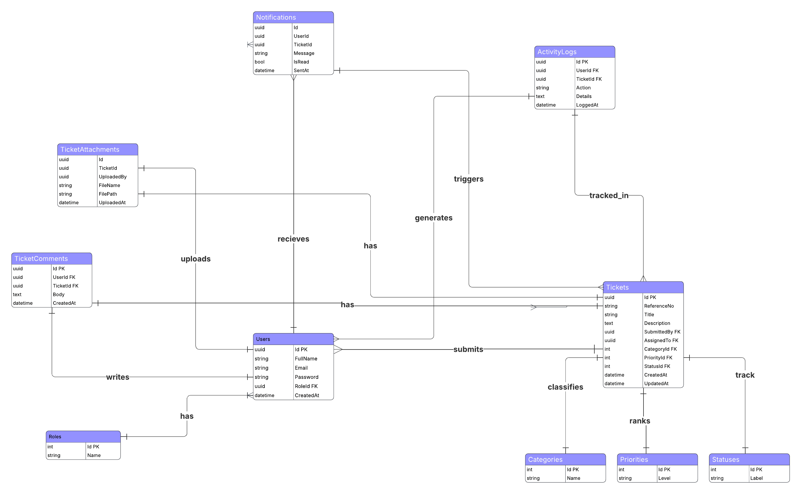

# IT Help Desk & Ticketing Management System

A modern, web-based enterprise SaaS platform designed to streamline internal technical support operations. This system allows employees to submit and track support requests, while IT support agents and administrators manage, prioritize, assign, and resolve tickets efficiently.

---

## Tech Stack

- **Frontend:** React.js, Tailwind CSS
- **Backend:** ASP.NET Core Web API (EF migrations)
- **Database:** PostgreSQL
- **Authentication:** JWT Authentication
- **Deployment:** vercel
<!-- - **AI Integration:** OpenAI API / Azure OpenAI (Alternative: Ollama for local AI) -->

---

## System Users & Roles

- **Admin:** Full system access, user/role management, and system monitoring.
- **Manager:** Monitors team tickets, assigns workloads, reviews reporting dashboards.
- **IT Support Agent:** Manages, comments on, escalates, and resolves assigned tickets.
- **Employee:** Creates tickets, uploads attachments, and tracks resolution progress.

---

## UI/UX Design System & Tokens

To maintain a consistent, accessible enterprise layout, follow these precise UI specifications:

### Layout Components

- **Page Background:** `Slate-50` (`#F8FAFC`) — gives elements breathing room (do not use pure white).
- **Sidebar:** Width 200–220px (fixed). Dark slate background (`#1E2A38`) with muted gray nav items and a Cyan active state highlight. Logo at top, user profile at bottom.
- **Topbar:** Height 48px, clean white background with a bottom border. Features a slate page title, subtle search bar, and a Cyan primary action button (`+`).
- **Cards & Panels:** White background, corner radius `8px` (`12px` for modals), and a `0.5px` border (`#E2E8F0`). Use a left accent border in Cyan for the highest priority statistics.
- **Primary Button:** Background `Cyan-500`, white text, border-radius `6px`.
- **Content Spacing:** `16px` horizontal / `14px` vertical padding.

### Color Tokens

| Token Name    | Hex Value             | Application                                               |
| :------------ | :-------------------- | :-------------------------------------------------------- |
| **Slate 900** | `#1E2A38`             | Sidebar background, H1 page headings                      |
| **Slate 800** | `#2D3E52`             | H2 Section headings                                       |
| **Slate 600** | `#475569`             | Standard UI boundaries/borders                            |
| **Slate 400** | `#94A3B8`             | Subtext, placeholders                                     |
| **Slate 50**  | `#F1F5F9` / `#F8FAFC` | Main app canvas layout backgrounds                        |
| **Cyan 500**  | `#06B6D4`             | Buttons, active navigation states, links, primary borders |
| **Cyan 400**  | `#22D3EE`             | Hover states, highlights over dark backgrounds            |
| **Cyan 50**   | `#ECFEFF`             | Light alerts, background accents                          |

### Semantic Status Colors

These statuses must remain color-consistent across lists, filter blocks, and detail pages:

- 🔵 **Open:** Cyan
- 🟡 **In Progress:** Amber
- 🟣 **Pending:** Violet
- 🟢 **Resolved:** Green
- 🔴 **Critical / Closed:** Red

### Typography

- **Font Family:** Inter, system-ui, sans-serif
- **Page Heading (H1):** `20px` | Weight 500 | Slate-900
- **Section Heading (H2):** `14px` | Weight 500 | Slate-800
- **Body Text:** `13px` | Weight 400 | Slate-700
- **Muted / Label:** `11px` | Weight 400 | Slate-500

---

## System Architecture & Workflows

### Business Logic Workflow

The step-by-step lifecycles of tickets and the behavioral permissions mapping across roles are fully illustrated in the architecture pipeline blueprint:

### Database Schema (ERD)

The backend data architecture maps relational integrity across tables (Users, Roles, Tickets, Comments, Attachments, Notifications, Categories, Priorities, Statuses, and Activity Logs):

